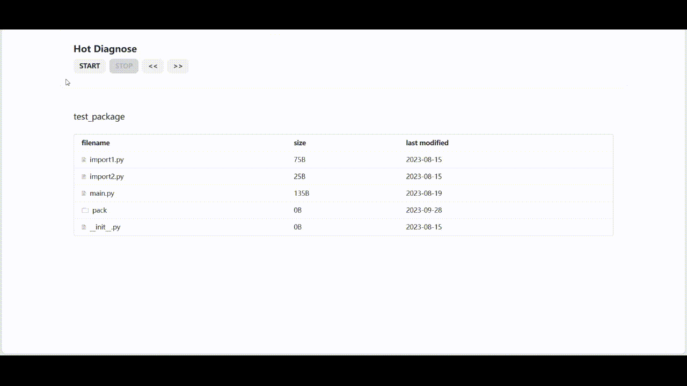

===============
Hot-diagnose: Python代码运行时诊断工具
===============

hot-diagnose是Python程序运行时诊断工具，也是唯一能够做到实时代码分析功能。它具有以下特点:

* 运行时诊断(Runtime Diagnose): 它可以根据不同运行参数、上下文环境，动态诊断Python程序运行效果。同时，
  由于Python的动态语言特性，该工具可以在程序运行时实时分析程序状态，更新诊断结果。
    
* 插件化(Plug-in Support): 该工具通过插件的方式提供大部分业务功能。用户也可以通过API实现自己的诊断工具。

* 无第三方依赖(No thrid-party dependency): 为了提高项目可维护性，最大发挥性能，该工具主体部分不依赖任何第三方包，
  渲染依赖少量的JS包。

安装
===============

目前该工具已上传pypi，可以通过pip安装该工具。同样也可以使用conda、pdm等方式:

.. code-block:: console

    pip install hot-diagnose

此外，也可以通过``setup.py``直接安装:

.. code-block:: console

    python setup.py install

使用
================

基础
----------------

hot-diagnose既支持Python脚本诊断，也支持Python包诊断。在诊断Python包时需要确定``PYTHONPATH``。
比如诊断Python脚本:

.. code-block:: console

    python -m diagnose -s script.py args1 args2

诊断Python包:

.. code-block:: console

    python -m diagnose -s package_entrance.py -p pythonpath args1 args2

更多详细的运行参数可以通过运行以下代码获得:

.. code-block:: console

    python -m diagnose -h

执行完毕后，hot-diagnose会自动弹出HTML页面展示诊断过程和结果。

诊断脚本:

.. image:: ./docs/img/scripts.gif

诊断包:

以上展示的是不包含任何插件的运行截图，通过插件可以实现代码覆盖率统计、Trace统计、Stack Frame统计等。

高级
----------------

hot-diagnose提供后端和前端两部分API为用户提供插件编写的接口

(未完待续)

贡献
================
(未完待续)

